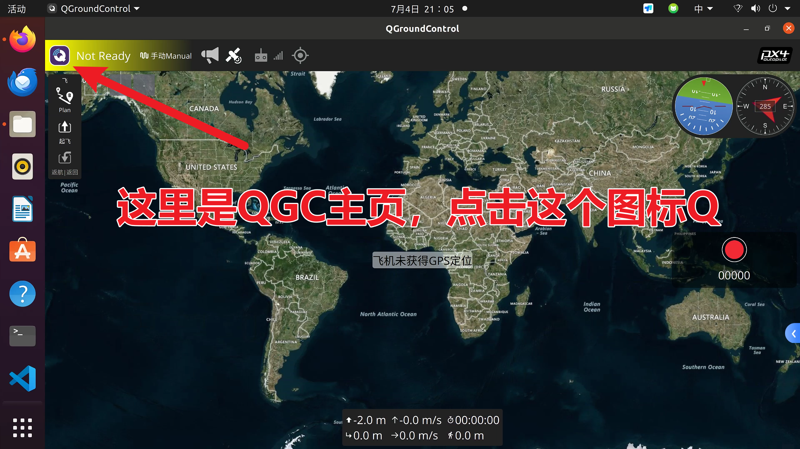
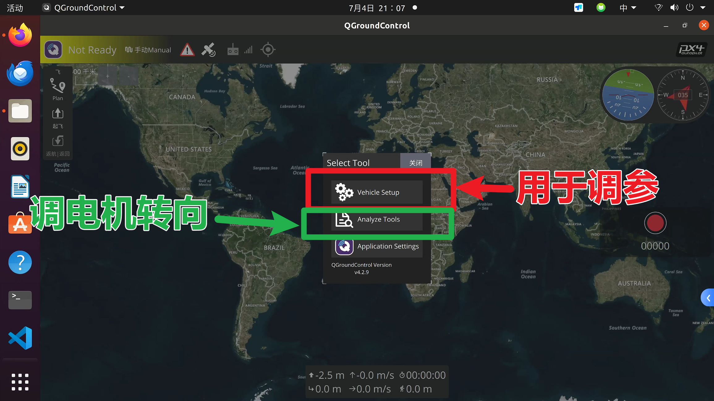
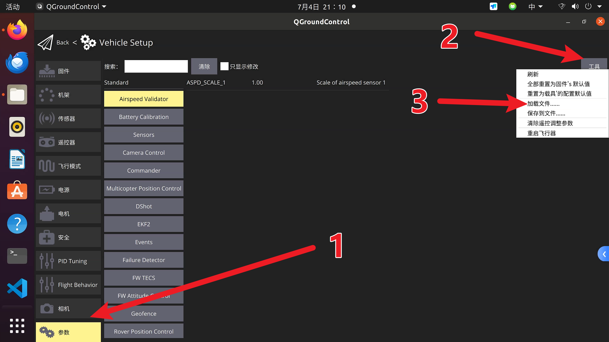
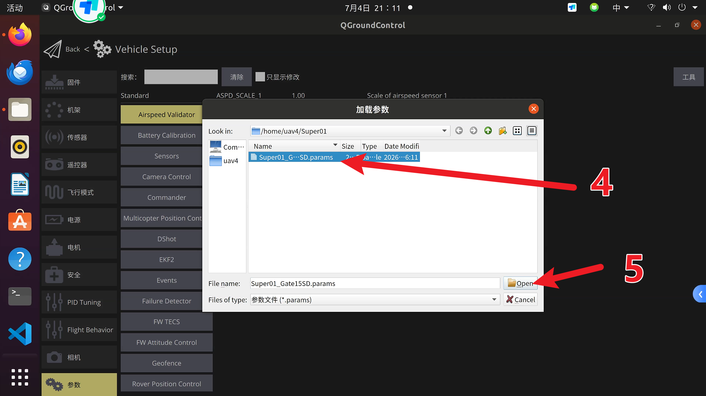
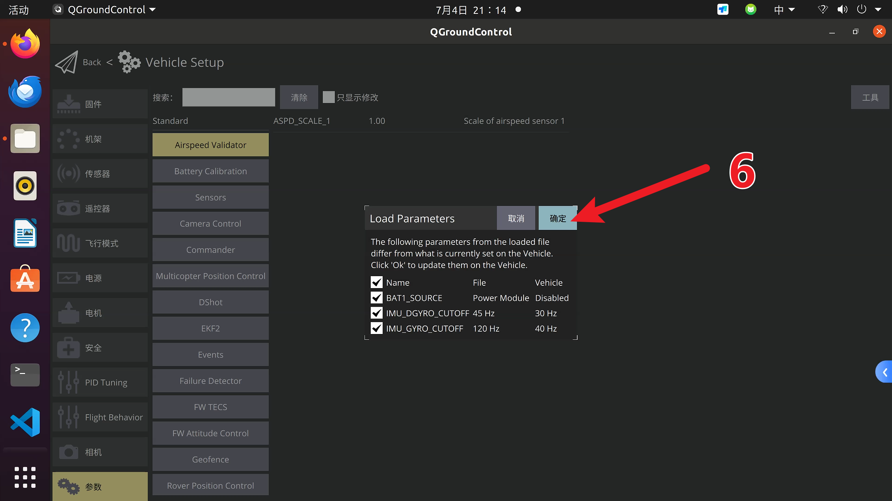
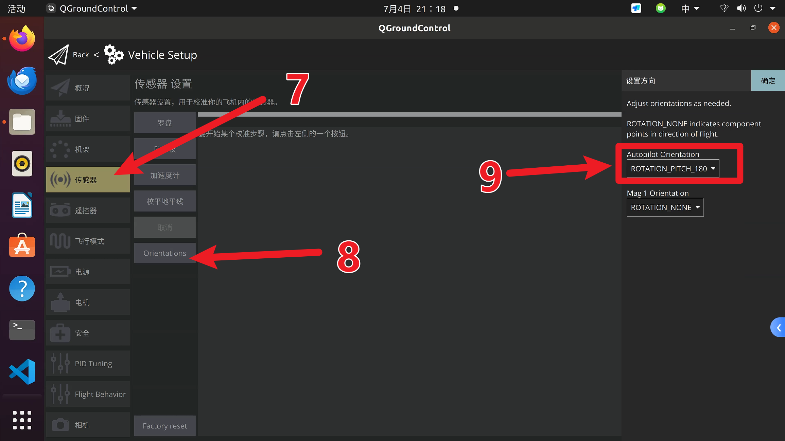
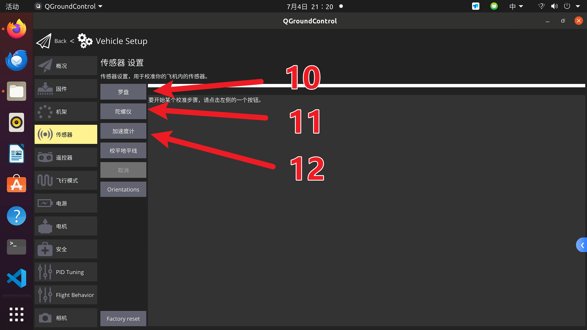
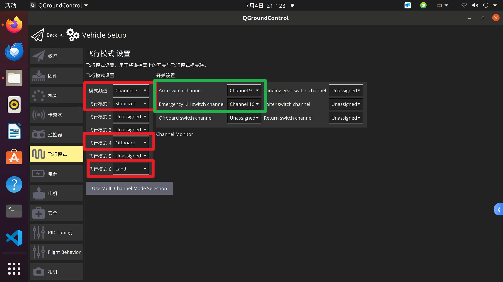

# 方案一：导入已有参数文件

本方案用于已经有同款 Super 飞机参数文件的情况。适用前提是：**PX6C / V6C 类飞控、PX4 v1.13.3、四旋翼、F60 MINI 4IN1 V2 电调、DShot600、NUC 通过 USB 连接 MAVROS、Mid-360 + Point-LIO 定位融合**。

!!! warning "导入前先备份"
    导入参数会覆盖飞控当前配置。导入前必须在 QGC 参数页保存一份当前参数文件，导入后再重新检查飞控朝向、电机顺序、遥控和 EKF 参数。

## 连接 QGC

飞控调参通过 USB 连接飞控 Type-C 口后，在 QGroundControl 中完成。调试电脑可以是 Windows 笔记本，也可以是机载 NUC。

如果在 Ubuntu 20.04 的 NUC 上安装 QGC，按本教程记录使用 **QGroundControl v4.2.9**。Windows 上可直接安装 QGC 桌面版。

{ .wide-photo }

进入 **Vehicle Setup**：

{ .wide-photo }

## 导入参数文件

进入 **Vehicle Setup > Parameters**，在工具菜单中选择加载文件：

{ .wide-photo }

选择后缀为 `.params` 的参数文件：

{ .wide-photo }

当前可直接下载并导入的参数文件：

- [下载 Super01_Gate15SD.params](https://github.com/Ma-Phil/SuperUAV-tutorial/raw/master/Super01_Gate15SD.params)

导入时勾选需要覆盖的参数并确认：

{ .wide-photo }

建议后续把固定参数文件放到项目的 `docs/assets/params/` 或 `params/` 目录，文件名使用：

```text
px4-v1.13.3-super-mid360-vision-pose.params
```

导入后重点抽查：

| 类别 | 参数 |
| --- | --- |
| 输出协议 | `DSHOT_CONFIG = DShot600` |
| EKF 定位融合 | `EKF2_AID_MASK = 24`、`EKF2_HGT_MODE = Vision` |
| EKF Gate | `EKF2_EVP_GATE = 15.0`、`EKF2_HDG_GATE = 6.0` |
| 外部视觉噪声 | `EKF2_EVP_NOISE = 0.01`、`EKF2_EVA_NOISE = 2.86deg` |
| 外部视觉延迟/安装偏移 | `EKF2_EV_DELAY = 5.0ms`、`EKF2_EV_POS_Z = -0.080m` |
| 安全断路器 | `CBRK_SUPPLY_CHK`、`CBRK_USB_CHK`、`CBRK_IO_SAFETY` |
| 电机输出 | `SYS_USE_IO = Disable PWM`、`MC_AT_EN = Disable` |

## 飞控朝向与传感器校准

按照现有 Super 飞机的飞控安装方式，飞控与机架的旋转姿态设置为 **Pitch 180°**：

{ .wide-photo }

导入参数并重新连接飞控后，进入传感器校准。按 QGC 提示旋转或保持飞机姿态：

{ .wide-photo }

建议顺序：

1. Gyroscope：飞机静止放平。
2. Accelerometer：按 QGC 提示摆放不同姿态。
3. Level Horizon：机体放在实际水平姿态。
4. Compass：若启用磁罗盘则校准；若主要依赖 Point-LIO yaw，也要避免留下不一致的罗盘配置。

## 飞行模式检查

进入 **Flight Modes**，确保飞行模式配置与当前 Super 飞机的既有设置一致：

{ .wide-photo }

## 导入后必须检查

完成参数导入和校准后，不要直接装桨。继续完成：

1. [电机测试与反转](motor-test.md)。
2. 遥控器校准和失控保护检查。
3. [NUC 的 MAVROS 连接检查](../nuc/px6c-usb-mavros.md)。
4. 启动 Mid-360、Point-LIO 和 `vision_pose` 桥接。
5. [EKF Gate 与融合检查](ekf-gate.md)。
