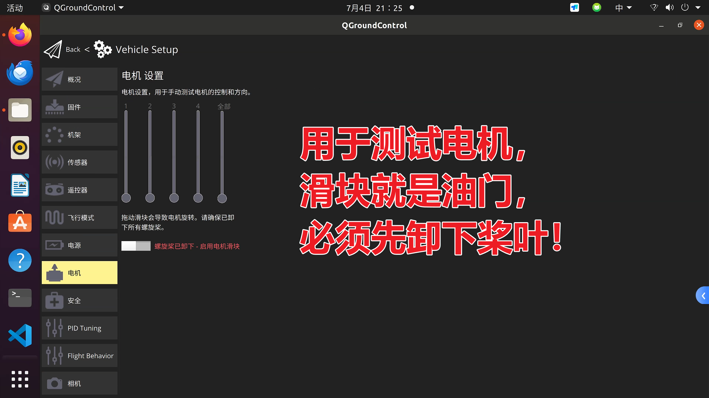
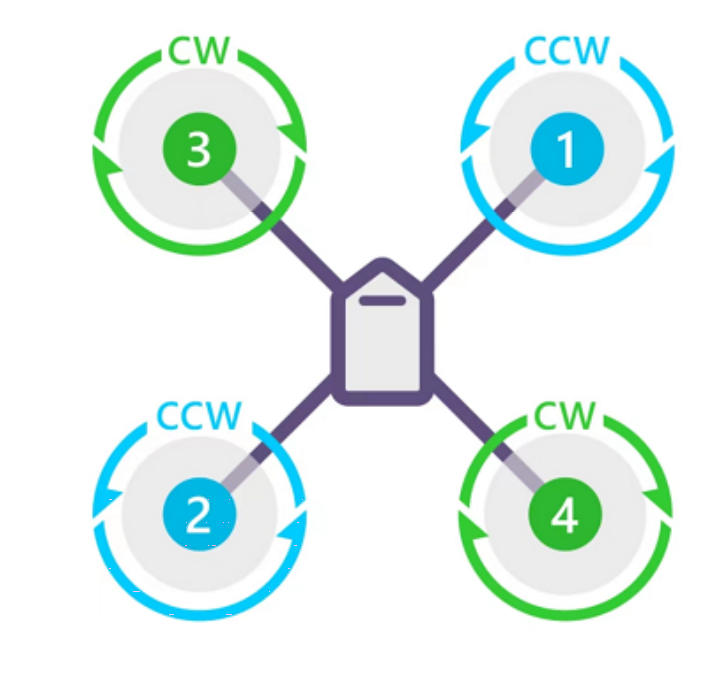
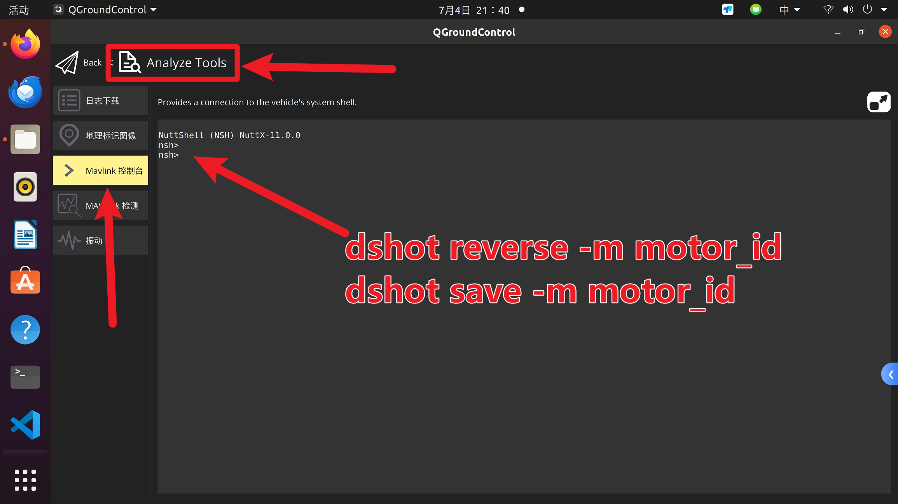

# 电机测试与反转

本页用于确认 QGC 中的 Motor 1~4 与实际物理电机位置、旋转方向一致。所有电机测试都必须在 **不安装桨叶** 的状态下进行。

## 进入电机测试

在 QGC 中进入 **Vehicle Setup**，打开电机 / 执行器测试页面，手动拖动对应电机的油门滑块：

{ .wide-photo }

## Motor ID 与期望转向

拖动 QGC 中的电机滑块时，应观察到：

| QGC 电机 | 物理位置 | 期望转向 |
| --- | --- | --- |
| Motor 1 | 前方右侧 | 逆时针 CCW |
| Motor 2 | 后方左侧 | 逆时针 CCW |
| Motor 3 | 前方左侧 | 顺时针 CW |
| Motor 4 | 后方右侧 | 顺时针 CW |

对照图：

{ .part-photo .motor-order-reference }

## 编号不对：先改信号线

如果 QGC 中 Motor 1 控制的不是前右电机，或 Motor 2/3/4 的物理位置不对应，优先检查飞控与电调之间的 ESC1~ESC4 信号线顺序。

{ .wide-photo }

## 编号正确但方向错误：优先 DShot 反转

当 Motor ID 对应正确，但旋转方向错误时，进入 QGC 的 MAVLink Console：

{ .wide-photo }

执行：

```sh
dshot reverse -m motor_id
dshot save -m motor_id
```

示例：Motor 3 方向错误：

```sh
dshot reverse -m 3
dshot save -m 3
```

每反转一个电机后，重新回到电机测试页面点动确认。

## DShot 反转无效时的兜底方法

如果 MAVLink Console 反转无效，断电后找到方向异常的电机与电调之间的三相线，交换任意两根。交换后重新上电测试，不要装桨。

## 通过标准

- QGC Motor 1 控制前右电机，方向 CCW。
- QGC Motor 2 控制后左电机，方向 CCW。
- QGC Motor 3 控制前左电机，方向 CW。
- QGC Motor 4 控制后右电机，方向 CW。
- 每次测试前确认桨叶未安装。
