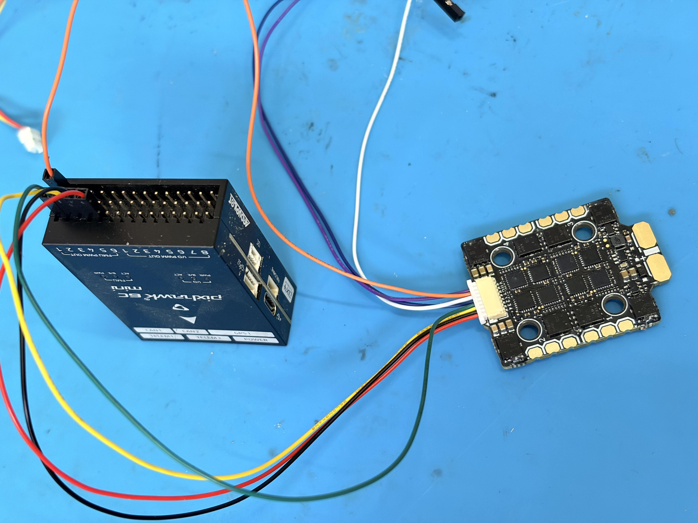
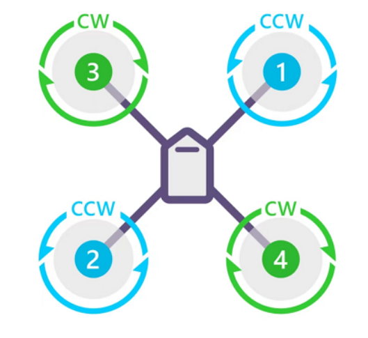

# 电调到飞控信号

本页说明 F60 MINI 4IN1 V2 电调到 PIX6C MINI 飞控的控制信号线。按当前方案，电调接 **PIX6C MINI 的 FMU PWM OUT / AUX OUT**，协议后续使用 **DShot600**。

!!! warning "不要接错输出口"
    接 FMU PWM OUT / AUX OUT，不是 I/O PWM OUT / MAIN OUT。电调信号线只需要信号和地线，不需要把电调的 V 接到飞控的 `+ / VDD_SERVO`。

!!! note "编号含义与最终判定"
    `ESC1`、`ESC2`、`ESC3`、`ESC4` 对应电调丝印 “1 2 3 4”；`FMU_CH1`、`FMU_CH2`、`FMU_CH3`、`FMU_CH4` 对应飞控 FMU PWM OUT 的 “1 2 3 4”。飞控侧 `S + -` 符号在接口侧面，对应三排针脚：`S` 为信号，`+` 为 VDD_SERVO，`-` 为 GND。

    `ESC1`、`ESC2`、`ESC3`、`ESC4` 与 `FMU_CH1`、`FMU_CH2`、`FMU_CH3`、`FMU_CH4` 不能只按编号直接认定正确。初始接线后必须按 [Motor ID 与期望转向](../flight-debug/motor-test.md#motor-id) 点动核对；若物理位置不对，调整 ESC 信号线，最终以 Motor ID 和期望转向全部正确为准。

## 接线步骤

1. 从 F60 MINI 4IN1 V2 的 8pin SH1.0 线中保留 `ESC1`、`ESC2`、`ESC3`、`ESC4`、`GND` 五根线。
2. 初始可将 `ESC1`、`ESC2`、`ESC3`、`ESC4` 分别接到 PIX6C MINI FMU PWM OUT / AUX OUT 的 `FMU_CH1`、`FMU_CH2`、`FMU_CH3`、`FMU_CH4` 信号位，后续按电机测试结果调整。
3. 将电调 `GND` 接到 FMU PWM OUT 的 `- / GND`。
4. `T`、`C`、`V` 三根线不接飞控，单独绝缘。
5. 接完后只做通电和 QGC 电机点动验证，不安装桨叶。

{ .wide-photo }

## 线序说明

F60 MINI 4IN1 V2 的 8pin SH1.0 端口按说明使用如下顺序：

```text
4  3  2  1  T  C  G  V
```

| 电调端口 | 含义 | 本教程处理 |
| --- | --- | --- |
| 1 | ESC1 / M1 信号 | 初始接 FMU_CH1 的 S，最终按 Motor ID 调整 |
| 2 | ESC2 / M2 信号 | 初始接 FMU_CH2 的 S，最终按 Motor ID 调整 |
| 3 | ESC3 / M3 信号 | 初始接 FMU_CH3 的 S，最终按 Motor ID 调整 |
| 4 | ESC4 / M4 信号 | 初始接 FMU_CH4 的 S，最终按 Motor ID 调整 |
| T | Telemetry，电调遥测 | 暂不接，单独绝缘 |
| C | Current，电流检测 | 暂不接，单独绝缘 |
| G | GND，信号地 | 接 FMU PWM OUT 的 - / GND |
| V | 电压 / 电源相关线 | 暂不接，单独绝缘 |

因此 SH1.0 转杜邦线只保留五根实际接入飞控：

```text
ESC1、ESC2、ESC3、ESC4、GND
```

`T`、`C`、`V` 三根线不要插入飞控，建议热缩管或绝缘胶带单独处理。

## 接飞控 FMU PWM OUT 说明

PIX6C MINI 的 FMU PWM OUT / AUX OUT 三行按说明理解为：

- `S`：FMU_CH1~6 信号行。
- `+`：VDD_SERVO，不接电调 V。
- `-`：GND，接电调 G。

| F60 电调线 | PIX6C MINI FMU PWM OUT |
| --- | --- |
| ESC1 / 1 | 初始接 FMU_CH1 的 S，最终按 Motor ID 调整 |
| ESC2 / 2 | 初始接 FMU_CH2 的 S，最终按 Motor ID 调整 |
| ESC3 / 3 | 初始接 FMU_CH3 的 S，最终按 Motor ID 调整 |
| ESC4 / 4 | 初始接 FMU_CH4 的 S，最终按 Motor ID 调整 |
| G | FMU PWM OUT 的 - / GND |
| T / C / V | 不接 |

## 电机编号原则

后续飞控调试中的电机测试应按 PX4 电机顺序核对：

{ .wide-photo .motor-rotation-standard }

```text
              机头
               ↑

       3 / CW         1 / CCW
       左前            右前

       2 / CCW        4 / CW
       左后            右后
```

| PX4 Motor ID | 位置 | 期望转向 |
| --- | --- | --- |
| Motor 1 | 右前 | CCW |
| Motor 2 | 左后 | CCW |
| Motor 3 | 左前 | CW |
| Motor 4 | 右后 | CW |

本机电机为倒置安装时，仍应统一按“从机体上方俯视”的方向去对照标准图；不要把从机体下方仰视看到的方向直接当成 PX4 方向。倒置安装通常影响桨叶正反和安装面，不改变 PX4 的 Motor ID 对应关系。

如果电调安装方向或电机焊接位置导致物理电机编号不同，应先确认电机焊在哪个电调铜板编号，再按 [Motor ID 与期望转向](../flight-debug/motor-test.md#motor-id) 调整 ESC 信号线到对应 FMU 通道。

## 后续验证

完成接线后，进入 [电机测试与反转](../flight-debug/motor-test.md) 页面，用 QGC 点动 Motor 1~4。若编号不对先调整 ESC1~ESC4 信号线；若编号正确但转向错误，优先使用 DShot 命令反转，最后才交换电机三相线。
