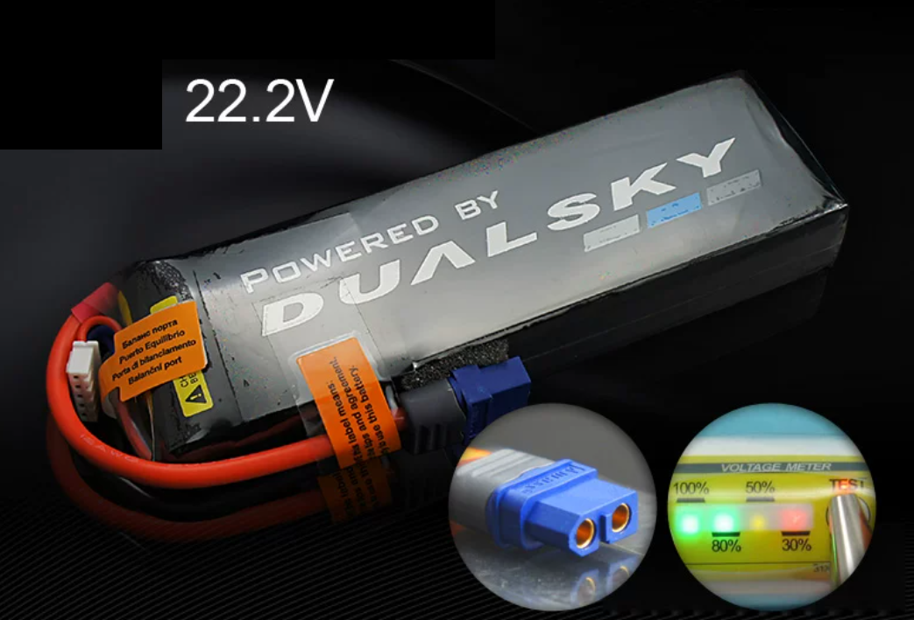
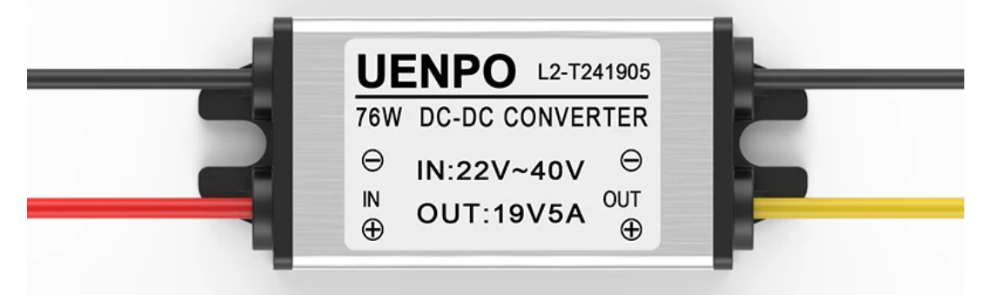
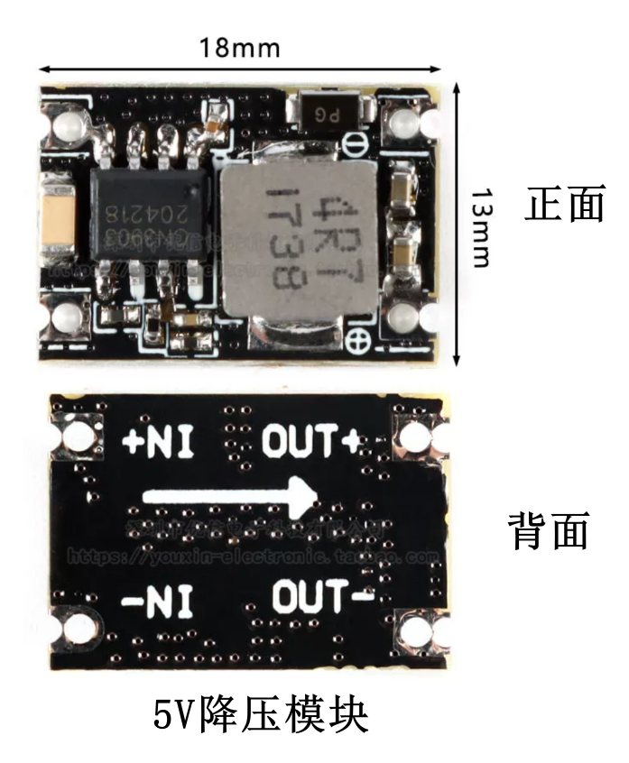
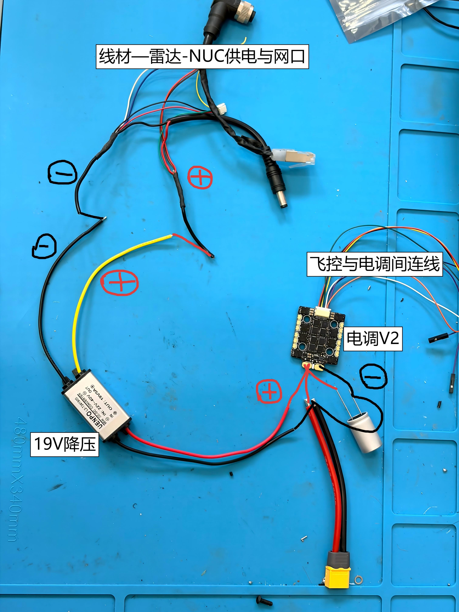
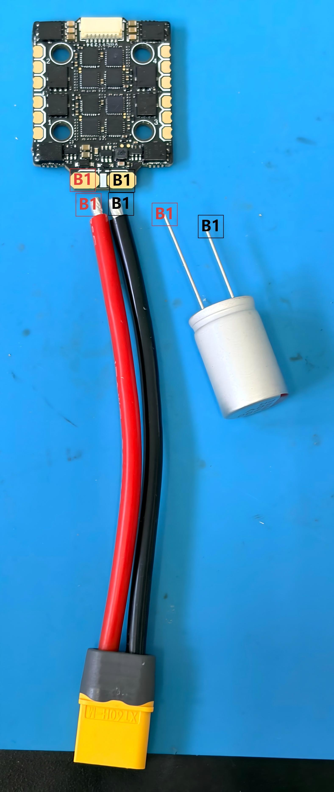
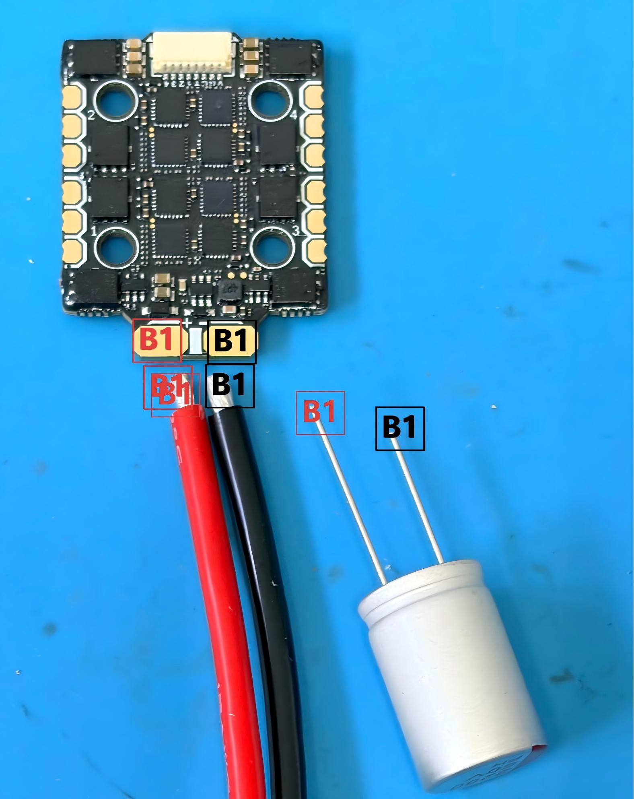
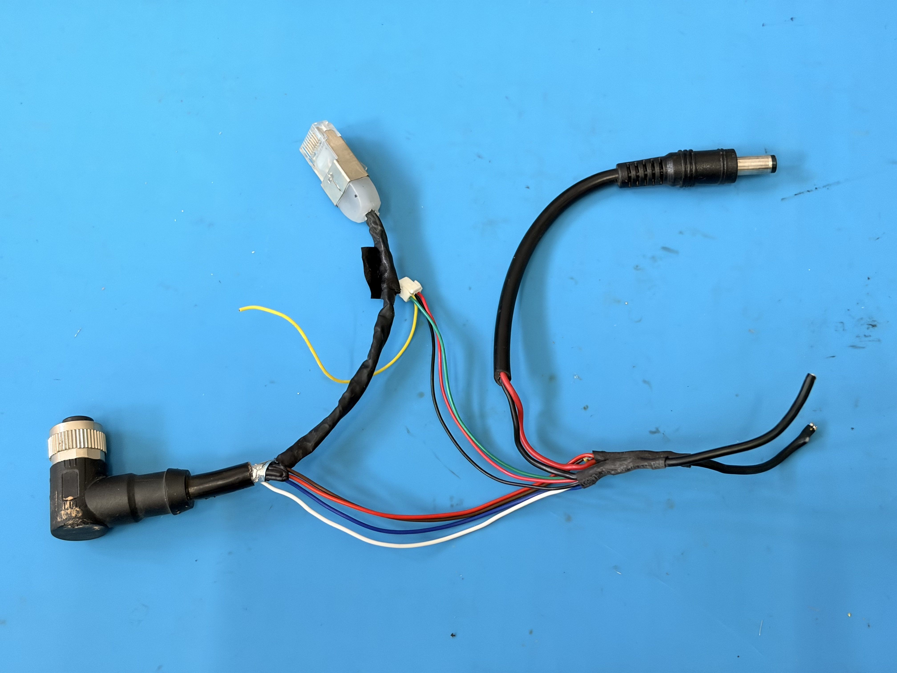
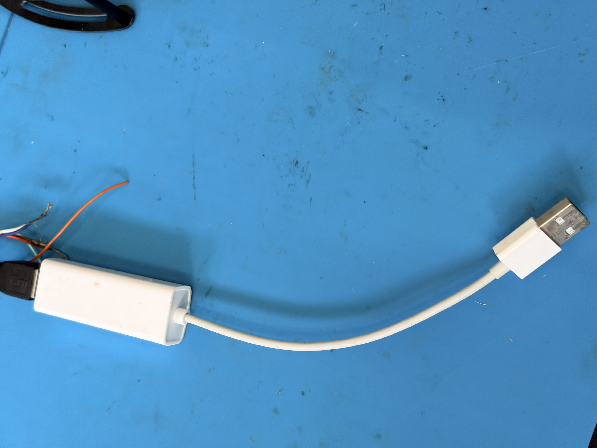

# 动力与供电

动力供电从 XT60 主电源分出四条关键支路。先按本页接线步骤完成主电源、降压模块、电调、电机和电容，再查看后面的部件说明与检查点。

!!! note "接线关系示意"
    当前只是接线关系示意。实际装机时需要先把飞控、电调、电机、降压模块、雷达和 NUC 等模块固定在机架上，并固定好各段连线；实际线路走向参考已有 Super 飞机。

!!! warning "先测电压，再接飞控"
    5V 降压输出接飞控前，必须先用万用表确认输出电压与极性。不要把电池高压直接接到飞控 5V / Power 输入。

## 接线步骤

1. F60 MINI 4IN1 V2 电调 -> F90 电机 KV1300 三相线。
2. XT60 电源线 -> F60 MINI 4IN1 V2 电调主电源端。
3. 50V 2200uF 外接电容并接在电调主电源输入端附近。
4. XT60 电源线 -> 5V 降压 -> 飞控 Power 接口。
5. XT60 电源线 -> 19V 降压 -> 雷达 / NUC 供电与网口线材。

## 部件说明

### 主电源与降压模块

{ .part-photo }
### 6S 电池 / XT60
整机主电源，作为电调、19V 降压和 5V 降压的源头；电容并接在电调主电源端。

{ .part-photo }
### 19V 降压
用于雷达 / NUC 供电支路。

{ .part-photo }
### 5V 降压
输出 5V 到飞控 Power 接口。

## 图片说明

### 供电接线示意

{ .wide-photo }

这张图对应不含飞控电源的供电主线：XT60 主电源经过焊接分配到 19V 降压、电调和相关线束。读图时先找 XT60，再沿红黑主线检查每个分支。

### 电调、电机与电容

{ .wide-photo }

{ .wide-photo }

- 电调主电源由 XT60 电源线焊接输入。
- F90 电机三相线焊接到电调对应电机输出焊盘。
- 50V 2200uF 电容并接在电调主电源输入端附近，用于抑制电源尖峰；总览图中按“电容接到电调端”表达，实际电气关系仍是主电源正负极并联。
- 本教程使用的是单独准备的 **50V 2200uF 外接电容**，不是 F60 MINI 4IN1 V2 电调包装中自带的小电容。选择外接电容时要核对耐压、容量、极性和引脚绝缘，耐压至少应高于 6S 电池满电电压并留有余量。
- 电机三相线本身没有正负极；若后续电机转向错误，优先在飞控调试阶段用 DShot 命令反转，必要时再交换任意两根相线。

### 雷达 / NUC 供电与网口

{ .part-photo }
### 雷达 / NUC 供电与网口线材
由 19V 降压支路供电，并分出雷达与 NUC 相关接口。

{ .part-photo }
### 网口转 USB-A
用于后续 NUC / 雷达通信连接。具体系统配置放到第三部分。

## 本页检查点

- XT60 正负极没有接反。
- 19V 降压输入接 XT60，输出接雷达 / NUC 支路。
- 5V 降压输入接 XT60，输出接飞控 Power 接口。
- 电调电源输入与 50V 2200uF 电容并接位置正确。
- 不装桨，不上电调试电机。
