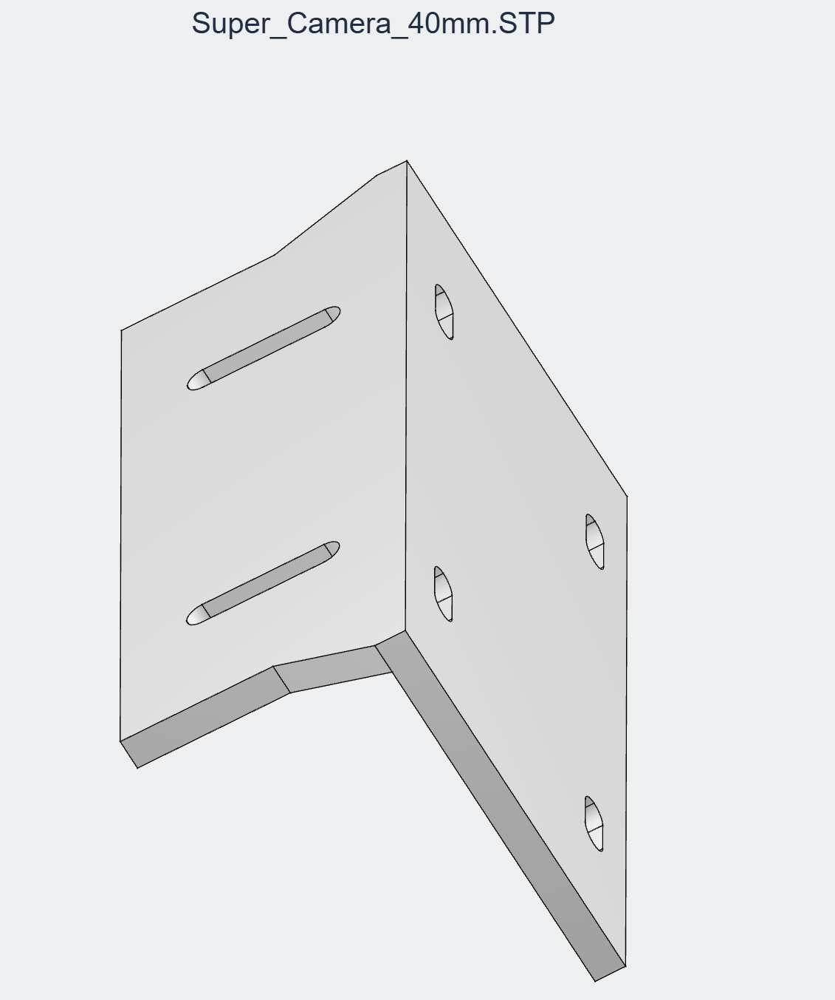

# Super 飞机与 RealSense D400/T265 相机支架

`Super_Camera_40mm.STP` 是用于连接 **Super 飞机与 RealSense D400/T265 相机**的支架模型。

## 模型下载

[下载支架 STEP 模型（Super_Camera_40mm.STP）](../assets/models/realsense-mount/Super_Camera_40mm.STP)

- 文件格式：STEP（`.STP`）。
- 适用对象：Super 飞机与 RealSense D400/T265 相机。
- 原始模型文件名保留为 `Super_Camera_40mm.STP`。

## 支架预览

相机的软件配置见 [RealSense 可选配置](../nuc/realsense.md)。
