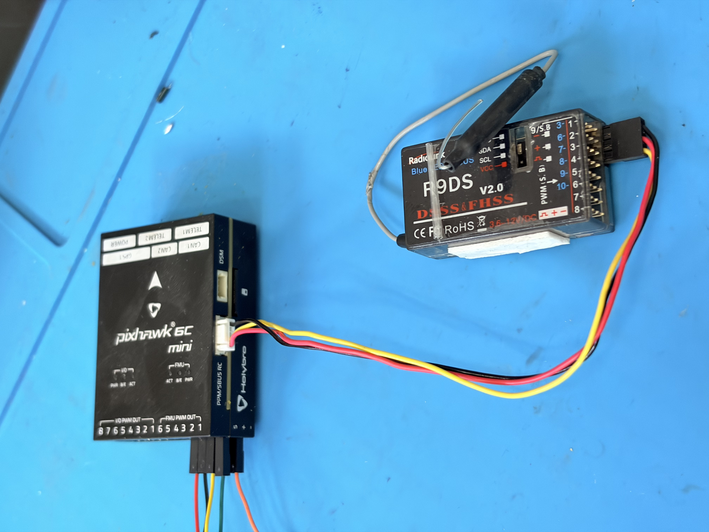

# 飞控到遥控接收器

飞控与遥控接收器的连接按现有示意图执行。当前版本先记录硬件连接，具体遥控协议、端口参数和通道校准放到第二部分飞控调试。

{ .wide-photo }

## 接线原则

- 先确认接收器所需电压，再接飞控供电引脚。
- 信号线接到飞控对应的遥控输入接口。
- GND 必须与飞控共地。
- 接线后不要立即装桨测试，先进入飞控调试页面完成遥控校准和失控保护检查。

## 本页检查点

- 接收器供电电压与接口定义一致。
- 信号线方向没有插反。
- GND 已接入。
- 接收器固定位置不会被桨叶、电机线或机架挤压。
